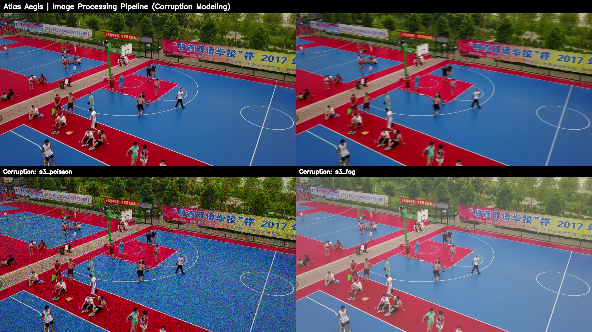
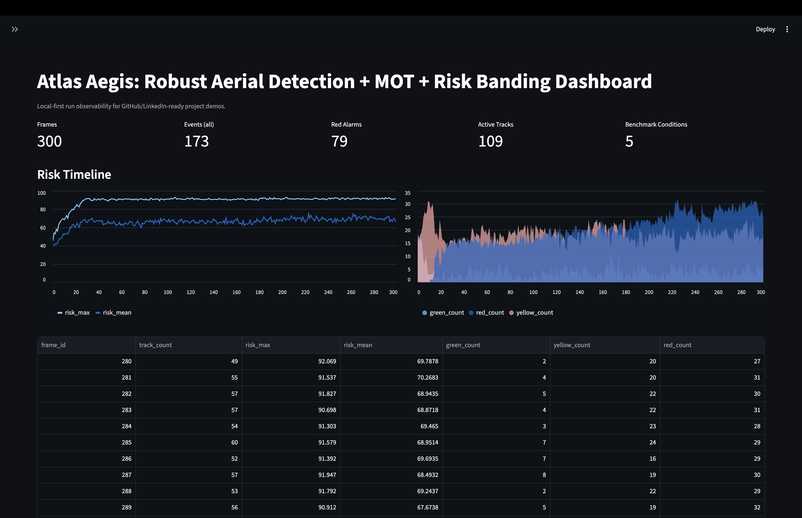
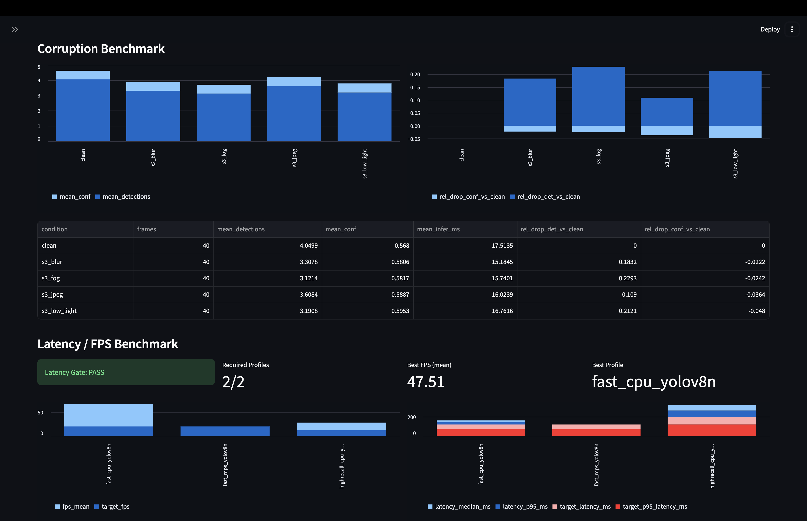
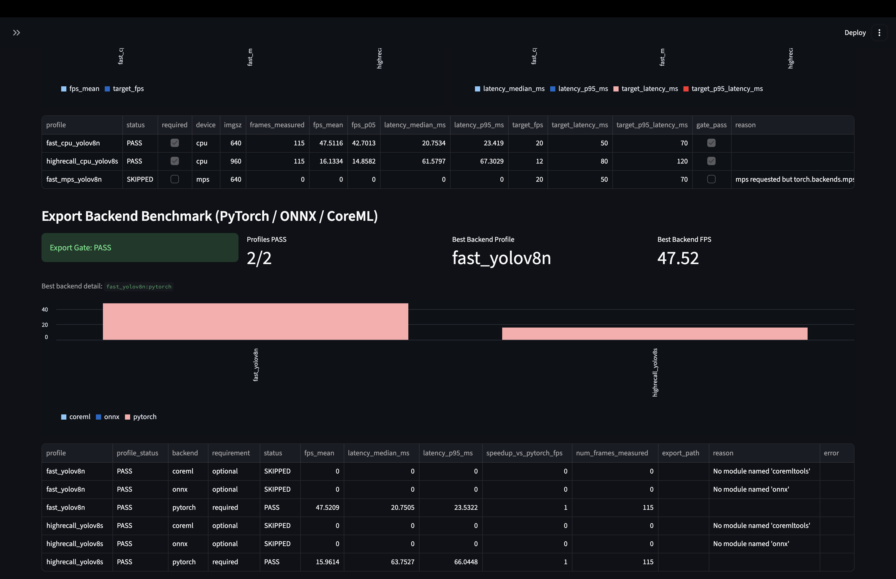
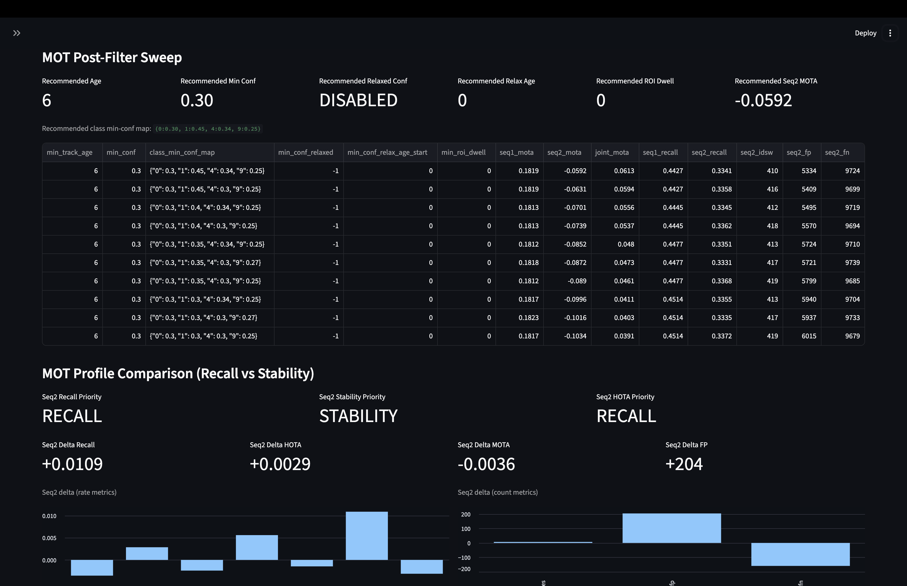
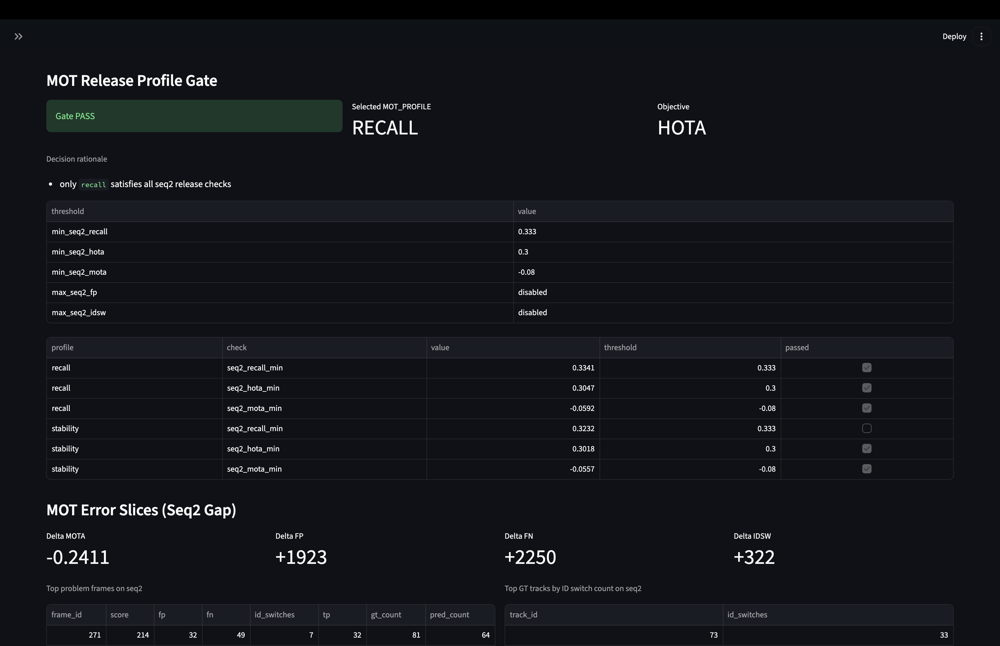
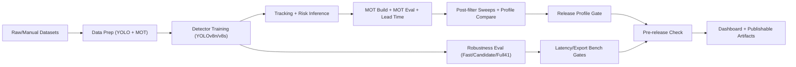

# Atlas Aegis: Robust Aerial Detection + MOT + Risk Banding (Local-First)

## 0) Top Showcase (Video + 2 Key Visuals)

### Demo Video
[▶ atlas_aegis_track_risk_overlay.mp4](assets/screenshots/atlas_aegis_track_risk_overlay.mp4)

### Detection + Tracking + Risk Banding


### Image Processing Pipeline (Corruption Modeling)


End-to-end R&D stack for small-object aerial perception:
- detector training and robustness evaluation (YOLOv8n / YOLOv8s),
- multi-object tracking with MOT metrics (MOTA/HOTA/AssA/DetA/IDSW),
- explainable risk scoring and Green/Yellow/Red banding,
- release gating with legal and budget guard rails,
- dashboard-ready outputs for portfolio/demo publishing.

This repository is designed to run primarily local-first on a single machine and keep direct cash spend under a strict budget policy (`hard_cap_usd: 15`).

Note: `Makefile` uses `.venv/bin/python` by default (`PYTHON ?= .venv/bin/python`).

## 0) Dashboard Gallery (12 Screenshots)

### Screenshot 1


### Screenshot 2


### Screenshot 3


### Screenshot 4


### Screenshot 5


### Screenshot 6


### Screenshot 7


### Screenshot 8


### Screenshot 9


### Screenshot 10


### Screenshot 11


### Screenshot 12


## 1) What this project implements

### 1.1 Core objective
Build a robust aerial analytics pipeline that is not evaluated only by one metric (mAP-like), but by:
- small-object-sensitive detector metrics,
- robustness under corruption conditions (fast/candidate/full tiers),
- MOT quality and stability across sequences,
- event lead-time and risk alarm behavior,
- latency/FPS and export backend gate checks,
- legal and budget compliance.

### 1.2 Quality philosophy
Every major stage writes explicit reports under `reports/` and can be used as a release gate:
- detector gates (`clean_recall_small_min`, `clean_recall_min`, `s3_recall_small_drop_max`),
- MOT profile gates (recall vs stability objective),
- latency and export benchmark gates,
- pre-release aggregate gate (`make pre-release-check` / `make release`).

## 2) High-level architecture



## 3) Methods and models

### 3.1 Detector models
- `Mode-Fast`: YOLOv8n (`configs/detector_fast.yaml`, 640 imgsz).
- `Mode-HighRecall`: YOLOv8s (`configs/detector_highrecall.yaml`, 960 imgsz).
- Robustness fine-tuning branches:
  - corruption-aware,
  - corruption-aware quick,
  - poisson-focus (quick/mid/1600),
  - blur-rescue.

### 3.2 Small-object definition
Implemented in `src/aerial_stack/visdrone_det.py`:
- `bbox_area < 32^2` OR `min(width, height) < 16 px`.

Used in gate-critical metric:
- `recall_small`.

### 3.3 Corruption methodology
Implemented in `src/aerial_stack/corruptions.py`:
- `blur`, `low_light`, `jpeg`, `gauss`, `poisson`, `dropout`, `fog`, `downsample`,
- severity levels `s1..s5`,
- deterministic seed per frame/key.

Tier design in `configs/pipeline.yaml`:
- `fast`: 5 conditions (clean + S3 core checks),
- `candidate`: 9 conditions (clean + richer S3),
- `full`: 41 conditions (clean + 8 corruption x 5 severity).

### 3.4 Risk banding model (explainable)
Implemented in `src/aerial_stack/risk.py` and used in `track_risk`.

Features:
- `duration_frames`, `conf_mean`, `conf_std`,
- `bbox_area_slope`, `roi_dwell`, `occlusion_count`.

Score:
- `risk = 100 * sigmoid(z)`,
- weighted linear form with configurable weights + bias (`configs/risk.yaml`).

Bands:
- `GREEN <= 39.999`,
- `YELLOW <= 69.999`,
- `RED >= 70`.

### 3.5 Tracking and fallback behavior
Implemented in `src/aerial_stack/track_risk.py`:
- primary: Ultralytics track + ByteTrack config (`configs/trackers/bytetrack.yaml`),
- fallback: if ByteTrack dependency (`lap`) is missing, auto-fallback to predict + IoU-greedy ID propagation.

### 3.6 MOT and event metrics
Implemented in `src/aerial_stack/mot_eval.py` and related scripts:
- MOT: `MOTA`, `MOTP(IoU)`, `precision`, `recall`, `IDSW`,
- HOTA family: `HOTA`, `AssA`, `DetA`, full alpha curve,
- event lead-time: median/p10/p90/mean from GT events vs predicted alarms.

### 3.7 Budget + legal guard rails
- Budget runtime gate: `src/aerial_stack/budget_runtime.py`,
- Threshold policy: `configs/budget.yaml`:
  - `soft_warning_usd: 8`,
  - `high_warning_usd: 12`,
  - `kill_switch_usd: 14`,
  - `hard_cap_usd: 15`.
- Legal gate: `src/aerial_stack/legal_gate.py` + `governance/legal_status.yaml`.

## 4) Tech stack and tools

### 4.1 Core stack
- Python package: `src/aerial_stack/*`
- Training/inference: `ultralytics`, `torch`
- Vision I/O: `opencv-python`
- Metrics store: DuckDB/SQLite compatible layer (`metrics_store.py`)
- Dashboard: `streamlit`, `pandas`
- Config: `pyyaml`

### 4.2 Optional backend/export stack
- ONNX path: `onnx`, `onnxruntime` (optional)
- CoreML path: `coremltools` (optional)

If optional backends are missing, export benchmark marks them `SKIPPED` (by design if backend requirement is optional).

### 4.3 Optional cloud/API posture
Repository design is local-first.
Cloud/API can be used for aggregate analytics and backup, but frame-level inference is local.

## 5) Repository structure

```text
project/
  app/
    dashboard.py
  configs/
    benchmark.yaml
    budget.yaml
    detector_*.yaml
    detector_eval*.yaml
    export_benchmark.yaml
    inference*.yaml
    latency_benchmark.yaml
    mot_eval.yaml
    pipeline.yaml
    risk.yaml
    trackers/bytetrack.yaml
  data/
    manual/      # user-provided archives or extracted manual datasets
    raw/         # downloaded/extracted raw data
    processed/   # YOLO-formatted + corruption-augmented datasets
    mot/         # MOT-format GT/PRED + GT events
  governance/
    legal_status.yaml
    production_data_checklist.md
    data_retention_access_policy.md
  logs/
    metrics.duckdb
    budget_ledger.json
    budget_events.jsonl
    *.jsonl tracking outputs
  reports/
    *.json, *.md (all stage outputs and gates)
  runs/
    detect/
    export_bench/
  scripts/
    00_*.py ... 28_*.py
  src/aerial_stack/
    benchmark.py
    budget_guard.py
    budget_runtime.py
    config.py
    corruptions.py
    data_lint.py
    legal_gate.py
    metrics_store.py
    mot_eval.py
    risk.py
    smoke.py
    track_risk.py
    visdrone_det.py
  Makefile
  DATASET_SETUP.md
  requirements.txt
  pyproject.toml
```

## 6) Dataset and license strategy

### 6.1 Dataset split by purpose
- Detector R&D: VisDrone DET
- MOT + risk validation: VisDrone MOT val sequences
- Additional test source: UAVDT
- DOTA exists for analysis scope but is not used as commercial training source in this pipeline.

### 6.2 Legal source of truth
Use `governance/legal_status.yaml` as gate authority:
- `visdrone2019_det`: research yes, commercial no
- `visdrone2019_mot`: research yes, commercial no
- `uavdt`: research yes, commercial yes (with attribution checks)
- `dota/xview/soda_a`: research yes, commercial no in current policy

### 6.3 Data acquisition flow

1) Automated UAVDT:
```bash
make data-download-uavdt
```

2) Manual datasets (VisDrone, DOTA):
- official pages:
  - VisDrone: <https://github.com/VisDrone/VisDrone-Dataset>
  - DOTA: <https://captain-whu.github.io/DOTA/dataset.html>
- place archives under:
  - `data/manual/visdrone/`
  - `data/manual/dota/`
- then run:
```bash
make data-prepare-manual
```

3) Verify status:
```bash
make dataset-status
```

Detailed notes: `DATASET_SETUP.md`.

## 7) Environment setup

```bash
python3 -m venv .venv
source .venv/bin/activate
pip install -e .
pip install -r requirements.txt
python scripts/00_env_check.py
```

Optional export deps:
```bash
pip install onnx onnxruntime coremltools
```

## 8) End-to-end runbook

### 8.1 Sanity and smoke
```bash
make env-check
make budget-demo
make smoke
make track-risk-dry
make bench-fast-dry
```

### 8.2 Prepare VisDrone DET in YOLO format
```bash
make prepare-visdrone-det
make lint-data
```

Optional smoke subset:
```bash
make prepare-visdrone-det-smoke
```

### 8.3 Download base weights
```bash
make weights-yolov8n
make weights-yolov8s
```

### 8.4 Detector training (fast and high-recall)
```bash
make train-det-fast-full-ep1
make train-det-fast-full-ep2-from-ep1
make train-det-fast-full-ep3-from-ep2

make train-det-highrecall-full-ep1
```

### 8.5 Detector evaluation tiers
```bash
make eval-det-fast-full-ep3
make eval-det-candidate-fast-full-ep3
make eval-det-highrecall-full-ep1
make eval-det-candidate-highrecall-full-ep1
```

Full41:
```bash
make eval-det-full41-fast-ep3
make eval-det-full41-highrecall-ep1
```

Background overnight variants:
```bash
make eval-det-full41-fast-ep3-bg
make eval-det-full41-highrecall-ep1-bg
```

### 8.6 Robustness recovery loops
Corruption-aware:
```bash
make prepare-visdrone-det-corruptaware
make train-det-highrecall-corruptaware-ep1
make eval-det-candidate-highrecall-corruptaware
```

Poisson focus and blur rescue:
```bash
make prepare-visdrone-det-poisson-focus-mid
make train-det-highrecall-poisson-focus-mid-ep1
make eval-det-candidate-highrecall-poisson-focus-mid

make prepare-visdrone-det-poisson-focus-1600
make train-det-highrecall-poisson-focus-1600-ep1
make eval-det-candidate-highrecall-poisson-focus-1600

make prepare-visdrone-det-blur-rescue
make train-det-highrecall-blur-rescue-ep1
make eval-det-candidate-highrecall-blur-rescue
make eval-det-full41-highrecall-blur-rescue
```

Candidate threshold sweep:
```bash
make eval-det-candidate-poisson-focus-1600-sweep
```

Single gated loop:
```bash
make loop-poisson-focus-1600
```

### 8.7 Tracking + MOT + release profile selection
Sequence 1:
```bash
make track-risk-visdrone-mot-val
make build-mot-visdrone-val
make mot-eval-visdrone-val
```

Sequence 2:
```bash
make track-risk-visdrone-mot-val-seq2
make build-mot-visdrone-val-seq2
make mot-eval-visdrone-val-seq2
```

Lead-time:
```bash
make build-gt-events-visdrone-val
make build-gt-events-visdrone-val-seq2
make eval-leadtime-visdrone-val
make eval-leadtime-visdrone-val-seq2
```

Sweep + compare + post-filter:
```bash
make mot-sweep-visdrone-val
make mot-sweep-visdrone-val-seq2
make compare-mot-sweeps
make mot-postfilter-sweep-recall
make mot-postfilter-sweep-classmap
make mot-error-slices
```

Profile compare and gate:
```bash
make mot-profile-compare
make mot-profile-release-gate
make mot-release-run
```

Optional profile override (if you want to force profile instead of auto release selection):
```bash
MOT_PROFILE=recall make build-mot-visdrone-val build-mot-visdrone-val-seq2
MOT_PROFILE=stability make build-mot-visdrone-val build-mot-visdrone-val-seq2
MOT_PROFILE=balanced make build-mot-visdrone-val build-mot-visdrone-val-seq2
```

### 8.8 Latency and export benchmark gates
```bash
make latency-bench-dry
make latency-bench-gate

make export-bench-dry
make export-bench-gate
```

### 8.9 Final release gate
```bash
make pre-release-check
make release
```

Strict mode:
```bash
make pre-release-check-strict
make release-strict
```

## 9) Dashboard (portfolio-ready)

Run:
```bash
make dashboard
```

Dashboard file:
- `app/dashboard.py`

Main cards and sections:
- risk timeline and band distribution,
- corruption benchmark deltas,
- detector gate table + condition metrics,
- MOT KPIs + HOTA curve + lead-time,
- MOT sweep/post-filter/profile gate analytics,
- latency/FPS gates and profile table,
- export backend (PyTorch/ONNX/CoreML) comparison,
- run history from metrics DB.

## 10) Configuration map

### 10.1 Core configs
- `configs/pipeline.yaml`: fast/candidate/full tier suite definitions.
- `configs/risk.yaml`: risk weights, bias, event min frames, band thresholds.
- `configs/budget.yaml`: spend thresholds and policy.

### 10.2 Detector train configs
- `configs/detector_fast.yaml`
- `configs/detector_highrecall.yaml`
- robustness branches:
  - `detector_highrecall_corruptaware*.yaml`
  - `detector_highrecall_poisson_focus_*.yaml`
  - `detector_highrecall_blur_rescue.yaml`

### 10.3 Detector eval configs
- `configs/detector_eval.yaml` (fast)
- `configs/detector_eval_candidate*.yaml` (candidate tier)
- `configs/detector_eval_full41_*.yaml` (full41 tier)

### 10.4 MOT and inference configs
- `configs/inference.yaml`
- `configs/inference_visdrone_mot_val*.yaml`
- `configs/mot_eval.yaml`
- `configs/trackers/bytetrack.yaml`

### 10.5 Benchmark configs
- `configs/benchmark.yaml`
- `configs/latency_benchmark.yaml`
- `configs/export_benchmark.yaml`

## 11) Script index

| Script | Purpose |
|---|---|
| `scripts/00_env_check.py` | Check Python/platform and required modules. |
| `scripts/01_data_lint.py` | Validate YOLO label format and ranges. |
| `scripts/01_download_data.sh` | Download UAVDT and print manual dataset instructions. |
| `scripts/01_prepare_manual_data.sh` | Extract/manual-link VisDrone and DOTA into `data/raw`. |
| `scripts/02_budget_guard_demo.py` | Simulate budget guard threshold behavior. |
| `scripts/03_smoke_run.py` | Synthetic smoke pipeline for risk scoring. |
| `scripts/04_eval_tier.py` | Print suite list for selected tier from `pipeline.yaml`. |
| `scripts/05_run_track_risk.py` | Real/dry tracking + risk banding runner. |
| `scripts/06_benchmark_corruptions.py` | Tier-based corruption benchmark with legal/budget checks. |
| `scripts/07_dataset_status.py` | Dataset presence/status checker. |
| `scripts/08_prepare_visdrone_det.py` | Build YOLO-format VisDrone DET dataset. |
| `scripts/09_train_detector.py` | Train YOLO detector from config. |
| `scripts/10_eval_detector.py` | Evaluate detector by condition and gate rules. |
| `scripts/11_download_weights.sh` | Download YOLOv8n/yolov8s weights. |
| `scripts/12_build_corruption_aug_det.py` | Build corruption-augmented detector dataset variants. |
| `scripts/13_eval_mot.py` | Evaluate MOT metrics + optional event lead-time. |
| `scripts/14_resolve_best_model.py` | Resolve best model path from report JSON. |
| `scripts/15_run_poisson_focus_1600_loop.sh` | Train + candidate gate + conditional full41 loop. |
| `scripts/16_eval_candidate_threshold_sweep.py` | Sweep conf/iou for candidate detector gate closure. |
| `scripts/17_build_mot_eval_files.py` | Convert GT annotations + track JSONL into MOT txt files. |
| `scripts/18_mot_tuning_sweep_visdrone_val.py` | MOT hyperparameter sweep against VisDrone MOT GT. |
| `scripts/19_compare_mot_sweeps.py` | Compare seq1/seq2 sweep reports and rank joint candidates. |
| `scripts/20_build_gt_events_from_visdrone_mot.py` | Generate GT event starts from VisDrone MOT annotations + ROI dwell. |
| `scripts/21_mot_error_slices.py` | Diagnose seq-level FP/FN/IDSW burst slices. |
| `scripts/22_mot_postfilter_sweep.py` | Sweep post-filter rules (age/conf/ROI/class map) across two sequences. |
| `scripts/24_compare_mot_profiles.py` | Compare recall-vs-stability profile metrics and winners. |
| `scripts/25_select_mot_release_profile.py` | Select release profile + export `mot_profile_release.env`. |
| `scripts/26_pre_release_check.py` | Run integrated pre-release checks and artifact validation. |
| `scripts/27_benchmark_latency.py` | Profile-level latency/FPS benchmark with gate logic. |
| `scripts/28_benchmark_exports.py` | Backend export benchmark (PyTorch/ONNX/CoreML) with gate logic. |

## 12) Make targets by domain

Primary groups in `Makefile`:
- environment and smoke: `env-check`, `lint-data`, `smoke`, `tier-*`,
- dataset and weights: `dataset-status`, `data-download-uavdt`, `data-prepare-manual`, `weights-*`,
- detector train/eval/full41 loops: `train-det-*`, `eval-det-*`, `loop-poisson-focus-1600`,
- tracking/MOT/build/eval: `track-risk*`, `build-mot-*`, `mot-eval*`,
- MOT optimization: `mot-sweep-*`, `mot-postfilter-*`, `mot-profile-*`, `mot-error-slices`,
- benchmarks: `bench-*`, `latency-bench*`, `export-bench*`,
- release: `pre-release-check*`, `release*`,
- dashboard: `dashboard`.

## 13) Key outputs and artifacts

### 13.1 Reports
All stage outputs are in `reports/`:
- training reports (`train_detector_*_report.json`),
- detector eval and comparison reports,
- MOT eval/sweep/postfilter/profile reports,
- benchmark reports (`benchmark`, `latency`, `export`),
- pre-release report (`pre_release_check_report.{json,md}`).

### 13.2 Logs and metrics DB
- frame logs: `logs/track_risk*.jsonl`,
- budget logs: `logs/budget_ledger.json`, `logs/budget_events.jsonl`,
- metrics DB: `logs/metrics.duckdb`,
- long-run logs/pids for background full41 tasks.

### 13.3 Model and run artifacts
- training/export artifacts under `runs/detect/` and `runs/export_bench/`.

## 14) Governance and production-readiness

Governance files:
- `governance/legal_status.yaml`
- `governance/production_data_checklist.md`
- `governance/data_retention_access_policy.md`

These define:
- R&D vs production dataset boundaries,
- source traceability and legal review expectations,
- retention/access/deletion policy skeleton for production data.

## 15) Pre-release gate details

`make pre-release-check` executes:
1. `env-check`
2. `dataset-status`
3. `smoke`
4. `bench-fast-dry`
5. `latency-bench-dry`
6. `export-bench-dry`
7. `eval-det-dry`
8. `mot-eval-dry`
9. `mot-release-run`
10. `compare-mot-sweeps`
11. `mot-error-slices`

Then validates required artifacts and release gate status.

## 16) Troubleshooting

### 16.1 `ultralytics` or `torch` missing
Install dependencies:
```bash
pip install -r requirements.txt
```

### 16.2 `lap` missing for ByteTrack
Tracking auto-fallbacks to IoU-greedy matching in `track_risk` runner.

### 16.3 ONNX/CoreML export skipped
Install optional dependencies (`onnx`, `onnxruntime`, `coremltools`) or keep them optional in `configs/export_benchmark.yaml`.

### 16.4 Model path not found during eval/train continuation
Use:
```bash
python scripts/14_resolve_best_model.py --report <train_report.json>
```
and update config/command accordingly.

### 16.5 Legal gate blocks commercial run
Check `governance/legal_status.yaml` and dataset key; do not bypass without explicit policy decision.

## 17) Notes for publishing (GitHub/LinkedIn)

Use these artifacts for a concrete demo story:
- `app/dashboard.py` + dashboard screenshots,
- detector gate reports (candidate/full41),
- MOT profile comparison + release gate reports,
- latency/export benchmark reports,
- pre-release check report.

This provides a measurable, governance-aware, and budget-controlled project narrative instead of only model accuracy numbers.
